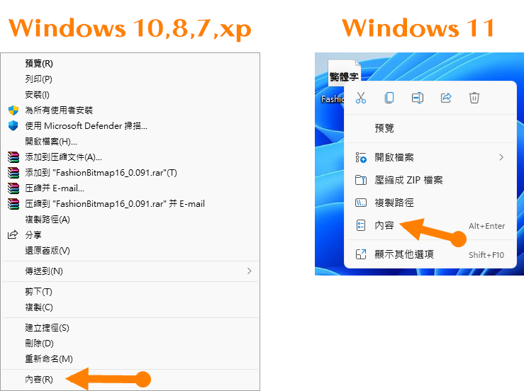
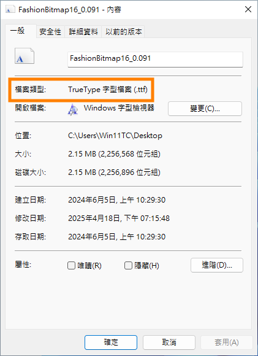
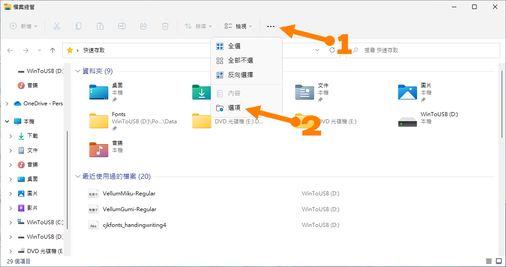
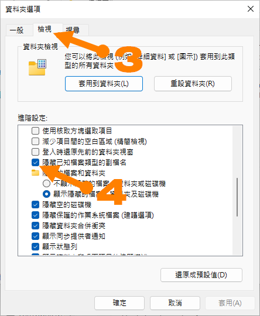

### 以 Windows 作業系統舉例。

## 方法１——適合暫時查看副檔名（後綴名）

①在您要查看副檔名（後綴名）的文件上按 **右鍵** 叫出選項。

②點擊 **內容**。

即可在檔案類型中看到文件格式及副檔名。 :bowtie:

## *推荐*.ᐟ 方法２——在檔案總管查看文件時顯示檔名及副檔名（後綴名）

①在工具列點擊3個點交出選單後點擊 **選項** 。

②點擊 **檢視** 選項卡，底下 **進階設定** 找到  **隱藏已知檔案類型的副檔名**，將勾勾打掉。

③點擊底下 **確定** ，即可在檔案總管隨時查看副檔名。 :bowtie:
