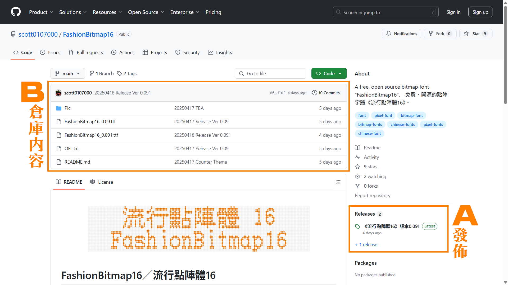
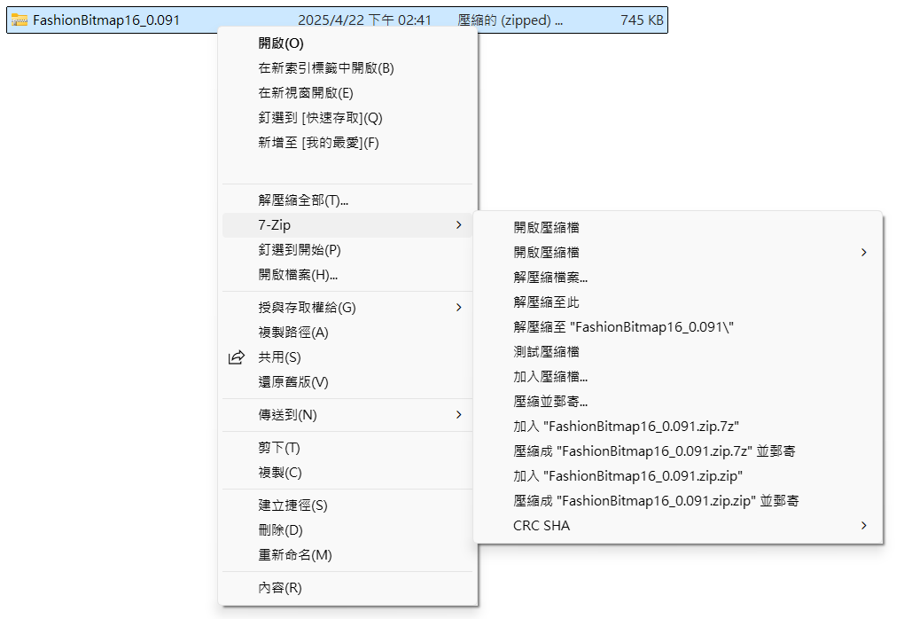
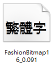
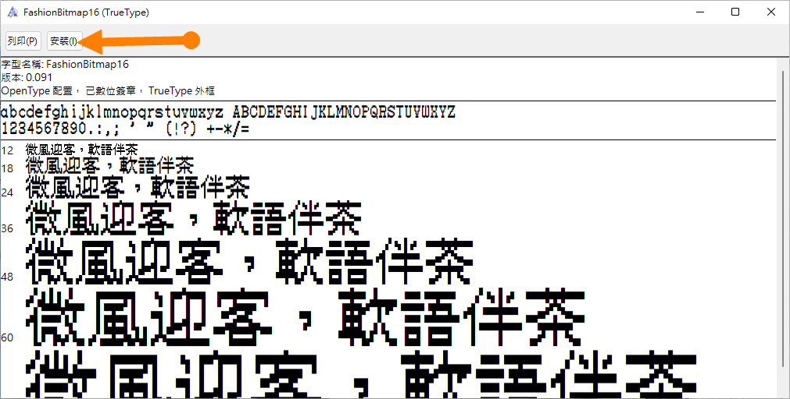
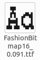
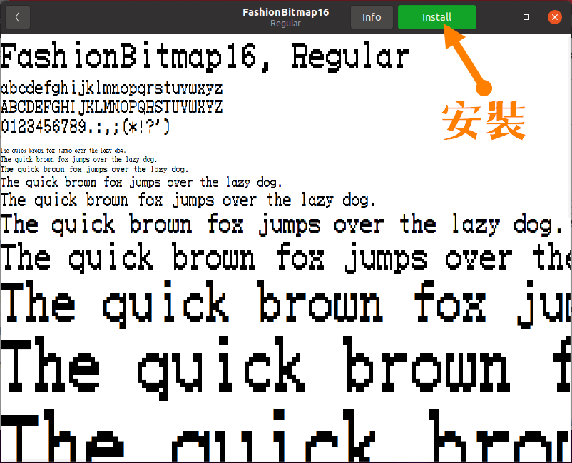
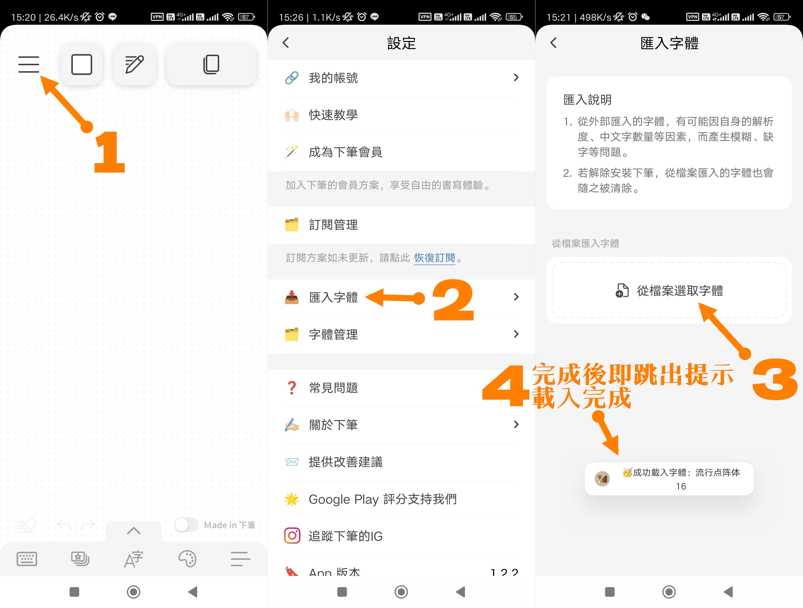
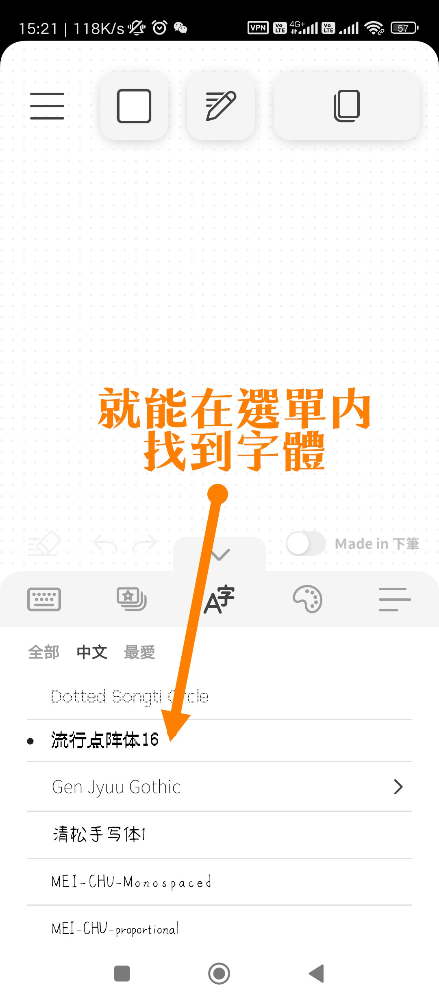

# 在Github上下載字體的正確姿勢 及 安裝方法

## 1第一步——找到你喜歡的字體發表在 Github 上的頁面並下載

舉例：[流行點陣體16：https://github.com/scott0107000/FashionBitmap16](https://github.com/scott0107000/FashionBitmap16)

您會看見這個畫面

您只需要在這兩區選擇一區即可下載到字體：

Ａ區通常是作者已經打包好字體文件的壓縮包¹或字體，通常只會有字體本身及授權許可證²——有些還有網頁字體³——，您可以很方便地在這裏直接下載到字體，但是可能包含各種字重各種格式（ttf、otf）的字體，導致壓縮包很大。您同時也需要有解壓縮軟件¹⁺，這個第二步說。

有些是將字體文件——ttf、otf——上傳於此，下載完後安裝方式請看[第三步](#3第三步進行安裝)。

Ｂ區則通常是這個專案——字體——的詳細文件，可能包括工程文件⁴、網頁字體文件、各種字重⁵的字體文件、授權許可證……等。你通常只需要找到ttf或otf格式的文件就可以下載來使用，安裝方式請看[第三步](#3第三步進行安裝)。

部分字體製作人會把所有歷來發佈過的所有版本都上傳上來，您僅需要下載最新版本就好——數字最大的。

### 注釋

¹壓縮包：指將文件壓縮並存儲、散播的一種文件。特色是可以減小文件存儲體積及方便將大量文件壓縮為一個文件傳播。常見格式有zip、rar、7z。

¹⁺壓縮軟件：能解壓壓縮包文件的軟件。

²授權許可證：字體的授權許可，包括[SIL OFL——開源免費商用——](https://scripts.sil.org/OFL)，[Apache License, Version 2.0——開源免費商用——](https://www.apache.org/licenses/LICENSE-2.0)等，這些許可決定了你是否能自由使用。——有些開源的字體并不能免費商用，請注意甄別——

³網頁字體：用於網頁顯示客制化字體的專用壓縮格式，通常為woff或woff2文件。

⁴工程文件：字體製作軟件製作字體時存儲的專用格式。

⁵字重：表示字體的不同粗細。如：細體（Light）、標準（Regular、常規）、粗體（Bold）。

## 2第二步——進行解壓縮

若下載完後的文件格式為zip、rar……等您就需要進行解壓縮。[——不知道如何查看點此——](./Filename.md)

您可以使用電腦內置解壓軟件——若有——或下載免費開源解壓縮軟件[7zip 官網](https://www.7-zip.org/) [繁體中文官網](https://www.developershome.com/7-zip/)，注意下載及安裝7zip軟件是 **免費** 的，您不應該為此付出額外的代價，包括提供金錢或服務。

！圖片從缺

下載完畢後即可進行解壓縮，您可以選擇解壓縮至相同文件夾或任意你知道存儲位置的路徑。解壓縮完畢即可進行安裝。

## 3第三步——進行安裝

請點擊您使用的系統→ [Windows 用戶](#Windows-用戶) [Mac 用戶](#Mac-用戶) [Linux 用戶](#Linux-用戶) [Android 用戶、下筆 APP 安裝](#Android-用戶下筆-APP-安裝) [iPad、iPhone 用戶全局安裝](#iPadiPhone-用戶全局安裝)

### Windows 用戶

①您會看見這個圖標的字體文件

②點２下進入預覽畫面，點擊安裝。

③完成！現在您可以在各大軟件中使用了。 :bowtie:

### Mac 用戶

### Linux 用戶

以 Ubuntu 示範。

①您會看見這個圖標的字體文件

②點２下進入預覽畫面，點擊安裝。

③完成！現在您可以在各大軟件中使用了。 :bowtie:

### Android 用戶、下筆 APP 安裝

①首先下載 ttf 字體文件至您的手機或平板。

②依照下圖指示即可匯入使用

③完成！現在您可以在下筆 APP 中使用了。 :bowtie:

### iPad、iPhone 用戶全局安裝

